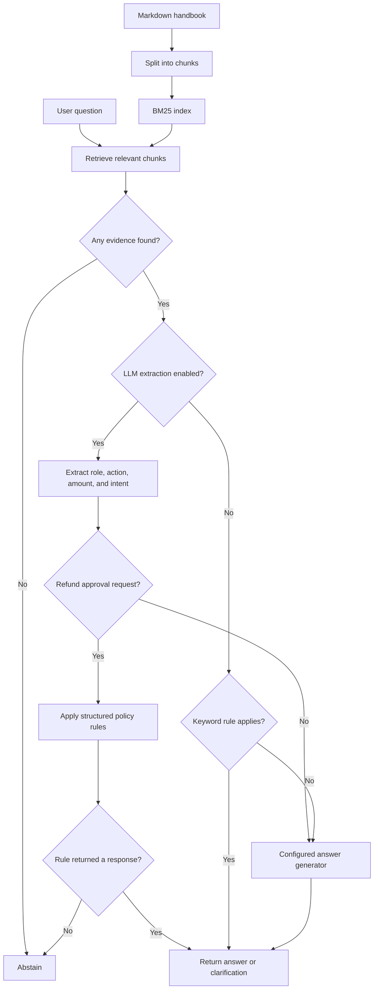

# Eval-Driven RAG

An evaluation-first RAG system built to measure whether each increase
in system complexity actually improves retrieval and answer quality.

Instead of starting with embeddings and an LLM, the project establishes
a deterministic BM25 baseline and progressively introduces:

- grounded LLM responses
- structured extraction
- deterministic policy decisions
- citation validation
- regression evaluation
- latency and token observability

## Current architecture



Extraction is optional. Policy rules require supporting evidence before
issuing an approval decision. Successful rules produce the response
without calling the answer generator.

The answer generator can be a local extractive baseline or an OpenAI
model. The OpenAI generator validates that cited IDs came from the
retrieved evidence.

Evaluation runs separately: it sends test questions through the
application and compares the responses with expected behavior.

## Run it

```bash
uv run python -m unittest discover -s tests -v
uv run evidence-rag ask --docs data/handbook.md "How quickly are critical incidents acknowledged?"
uv run evidence-rag eval --docs data/handbook.md --dataset data/eval.jsonl
```

No API key or services are required for this milestone.

The offline unit tests require no API calls. Install `uv sync --extra llm` to include the mocked OpenAI-adapter tests; without that extra, those adapter tests are skipped. The structured-pipeline tests supply fixed extraction fixtures, so they verify routing and policy behavior rather than model accuracy.

The application evaluation is different from the unit tests. With the current 13-case development dataset:

| Mode | Expected offline result | Meaning |
|---|---:|---|
| Baseline without rules or extraction | 5/13 | Extractive sentences do not provide the required decisions and clarification states. |
| Baseline with keyword rules, without extraction | 11/13 | Missing-role and missing-amount clarification remain unsupported by this legacy path. |
| Structured pipeline with correct fake extractions | 13/13 | Deterministic routing and policies satisfy these fixtures; this is not an LLM accuracy result. |

The `eval` command exits with status 1 when any case fails, including these intentional baseline comparisons. The live extraction path requires an API key and must be evaluated separately.

## Use the model-backed provider

Install the optional model dependencies:

```bash
uv sync --extra llm
```

Create a local secret file that Git will ignore:

```bash
cp .env.example .env
```

Edit `.env` and replace `replace-me` with your API key. Never commit or share that file. Load it into your current terminal and ask a question:

```bash
set -a
source .env
set +a

uv run evidence-rag ask \
  --provider openai \
  --docs data/handbook.md \
  "What happens after I cancel a monthly subscription?"
```

The answer generator's fallback model is `gpt-5.6-terra`. You can override it with `--model` or `OPENAI_MODEL`. The provider sends the question and retrieved chunks, requires structured output, treats document content as untrusted, and rejects citations that were not supplied by retrieval.

Every answer now includes an observability block:

```json
{
  "metrics": {
    "provider": "openai",
    "model": "gpt-5.6-terra",
    "retrieval_ms": 0.12,
    "generation_ms": 850.42,
    "input_tokens": 240,
    "output_tokens": 55,
    "total_tokens": 295
  }
}
```

The exact numbers vary. Retrieval time measures local BM25 search, generation time measures the complete provider call, and token counts come from the API response. Evaluation summaries aggregate these fields across the dataset.

Experiment findings are kept in [`experiments/`](experiments/). The apparent contradictions in Experiments 001 and 002 were later traced to shell mutation of the input; [Experiment 003](experiments/003-shell-input-diagnosis.md) corrects that interpretation. They do not establish a model reasoning failure. The regression suite still checks conclusions separately from keywords and citations.

For yes/no questions, the model must also return a typed `decision` field with one of `yes`, `no`, or `not_applicable`. Eval cases can declare `expected_decision`, allowing the conclusion to be checked independently from the explanation.

Structured output constrains shape, not semantic accuracy. [Experiment 004](experiments/004-extraction-model-comparison.md) records actual field-level extraction failures and the model comparison used to select the working extractor. Approval-threshold decisions remain in application code.

Use the hybrid rule engine for policy decisions:

```bash
uv run evidence-rag ask \
  --provider openai \
  --rules data/policy_rules.json \
  --docs data/handbook.md \
  'Can a support agent approve a $250 refund?'
```

With extraction disabled, the refund rule runs before the answer model. If it applies and its cited policy was retrieved, application code computes the decision and skips the paid model request. Other questions continue to the selected answer generator.

Use single quotes around terminal arguments containing `$`. Double quotes allow the shell to expand `$250` before Python receives it. The CLI echoes the received `question` in its JSON output so input mutation is visible.

Paid request counts depend on routing. Without extraction, rules or an early no-evidence response can avoid the answer-model call. With extraction enabled, questions with retrieved evidence make an extraction call and may also make an answer-generation call. Start with a single question before running a full comparison.

## LLM extraction with deterministic policy decisions

The extractor converts a question into `role`, `action`, `amount`, and `intent`. Policy code distinguishes checking a person's authority from identifying an approver, and handles missing details with a clarification response. Retrieved evidence is still required for policy answers.

```bash
uv run --env-file .env evidence-rag eval \
  --provider baseline \
  --extractor openai \
  --model gpt-5.6-terra \
  --rules data/policy_rules.json \
  --docs data/handbook.md \
  --dataset data/eval.jsonl
```

`--extractor` selects interpretation; `--provider` selects fallback answer generation. `--model` overrides `OPENAI_MODEL`, which overrides the code fallback. Using `--env-file .env` explicitly loads the local environment file.

The latest user-reported application run passed **13/13 cases** after switching to Terra. In a focused comparison on “Can an agent approve a refund?”, nano guessed a support-agent role in **5/5** calls, while Terra preserved the missing role in **5/5**. These small development samples justify a provisional project choice, not a general accuracy claim. Read the [complete experiment and limitations](experiments/004-extraction-model-comparison.md).

Answers include `extracted_request`, `needs_clarification`, and `metrics.extraction`. Decimal amounts in traces are strings for JSON serialization. Top-level token counts include both extraction and answer generation; missing usage remains `null`. Generation timing excludes extraction. The summary's `models` list currently describes answer producers only; inspect individual `metrics.extraction.model` fields to identify the extractor.

## Baseline architecture

```text
Markdown -> heading-aware chunks -> BM25 index -> top-k evidence
                                                   |
Question ------------------------------------------+
                                                   v
                                      extractive grounded answer
                                                   |
                                                   v
                                 citations + regression evaluator
```

The interfaces are small so later milestones can replace retrieval and answer generation independently.

## Milestones

### M0 — local baseline (included)

- Heading-aware chunking
- Dependency-free BM25 retrieval
- Extractive answers with citations
- JSONL regression cases and offline metrics
- Unit tests

### M1 — model-backed grounded answers

- [x] Add the OpenAI SDK and Responses API behind an `AnswerGenerator` interface.
- [x] Use Structured Outputs for answer, citations, and abstention reason.
- [x] Validate citations against the retrieved evidence.
- [x] Record latency and token usage for baseline/model comparisons.
- Default normal traffic to a cost-balanced model; make the stronger model an evaluated routing decision.
- Add prompt-injection cases and ensure document text is always treated as untrusted data.

### M2 — production retrieval

- Add embeddings and PostgreSQL + pgvector.
- Combine BM25 and vector candidates using reciprocal-rank fusion.
- Add a reranker only if it improves recall/precision enough to justify latency and cost.
- Measure recall@k, MRR, answer correctness, citation precision, and abstention accuracy.

### M3 — service and operations

- Add FastAPI endpoints, streaming, rate limits, and request IDs.
- Add OpenTelemetry traces spanning retrieval, model calls, and evaluation.
- Record P50/P95 latency, token usage, estimated cost, and quality regressions.
- Add Docker, CI, a load test, and a threat model.

## Portfolio deliverables

- A 50+ item eval set with labeled failure categories.
- A results table comparing lexical, vector, hybrid, and reranked retrieval.
- An architecture decision record explaining why each dependency was added.
- Screenshots of traces and an evaluation dashboard.
- A short demo that includes one failure and how the eval suite caught it.
